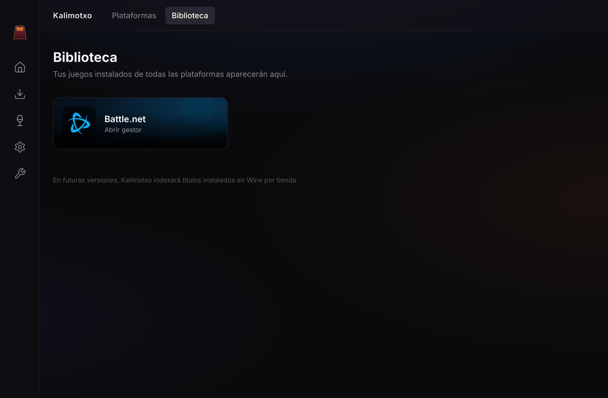
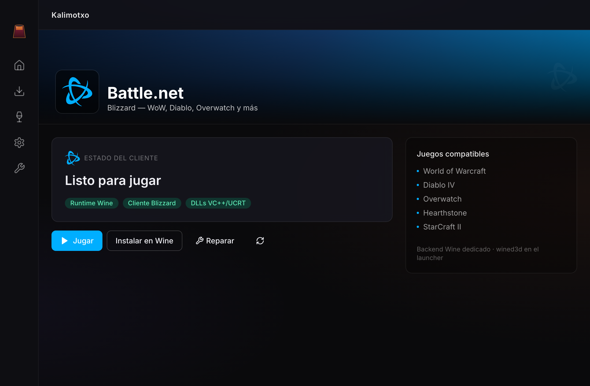
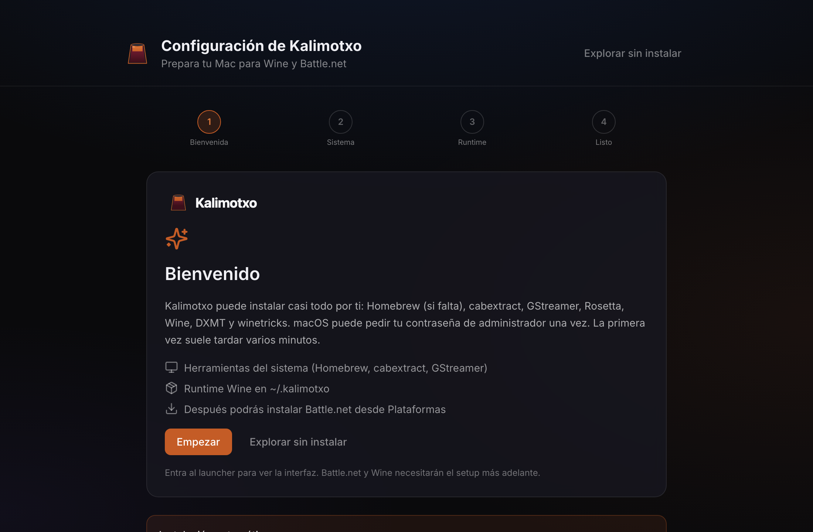

<div align="center">

# Kalimotxo

**A Wine manager for macOS on Apple Silicon, focused on Battle.net.**

Install and launch the Battle.net client (and its games) on Wine with
Metal-accelerated graphics — no CrossOver and no manual configuration required.

[](LICENSE)


</div>

---

Kalimotxo is a desktop app (Electron + TypeScript + React) that sets up a
"Battle.net-ready" Wine environment on Apple Silicon Macs: it downloads the right
runtime (Wine 11 + DXMT + Game Porting Toolkit), creates the bottle, resolves the
dependencies and launches the client with the correct configuration.

## Status

- ✅ **Battle.net installation** automated inside the bottle.
- ✅ **Client launch**: visible window, login and game downloads (tested with
  *Diablo II: Resurrected*) on Apple Silicon.
- 🛠️ In progress: polishing the game-install experience and QA across more machines.

Getting the Battle.net client (32-bit CEF/Chromium) to run on Apple Silicon
requires a very specific stack plus several fine-grained graphics-present and IPC
fixes. The debugging process and the root cause of each problem are documented in
[`docs/battlenet-wine-problemas-y-roadmap.md`](docs/battlenet-wine-problemas-y-roadmap.md).

## Screenshots

| Library | Battle.net | Setup wizard |
|:---:|:---:|:---:|
|  |  |  |

## Requirements

- macOS on **Apple Silicon** (M1 or newer).
- **Node.js ≥ 22** and **pnpm ≥ 9** (`corepack enable` or `brew install pnpm`).
- Homebrew with `cabextract` and `gstreamer` (the wizard can install them).
- Rosetta 2 (for the x86 components that run under emulation).

> Wine and the graphics components are **not** bundled in the app: they are
> downloaded once into `~/.kalimotxo` (several hundred MB). Apple's Game Porting
> Toolkit is subject to its own license and is not redistributed
> (see [CREDITS](CREDITS.md)).

## First run

On first launch Kalimotxo shows the setup wizard at `/setup`. "Prepare everything
automatically" installs winetricks, cabextract, GStreamer, Rosetta 2 and
downloads Wine + DXMT. The **Setup** icon in the sidebar reopens it anytime.

## Development

This project uses **pnpm** exclusively.

```bash
pnpm install
pnpm start          # Electron window with hot reload
pnpm run codecheck  # TypeScript (no emit)
pnpm run test       # tests (Jest)
pnpm run build      # production build
pnpm run dist:mac   # signed Kalimotxo.app in dist/mac/
```

See [CONTRIBUTING.md](CONTRIBUTING.md) for conventions (English code, Conventional
Commits).

## Architecture

```
src/
  backend/          # Main process: IPC, Wine, Battle.net
    wine/           # Wine environment, runtimes, graphics layers
    storeManagers/  # Battle.net orchestration (install/repair/launch)
  preload/          # typed window.api
  frontend/         # React + Tailwind
  common/types/     # IPC contracts
```

Battle.net backend entry points:

- [`wine/wineEnv.ts`](src/backend/wine/wineEnv.ts) — builds the launch environment.
- [`wine/wineRuntimeLibs.ts`](src/backend/wine/wineRuntimeLibs.ts) — places MoltenVK and gnutls where Wine loads them without `DYLD_FALLBACK`.
- [`storeManagers/battlenet/agentPortBridge.ts`](src/backend/storeManagers/battlenet/agentPortBridge.ts) — Update Agent bridge (port 1120).
- [`storeManagers/battlenet/service.ts`](src/backend/storeManagers/battlenet/service.ts) — install / repair / launch.

## Languages

UI available in English, Spanish, French, Italian, Portuguese and German
(**Settings → System**, or auto-detected on first run).

## Credits

Kalimotxo derives from the Wine manager of
[Heroic Games Launcher](https://github.com/Heroic-Games-Launcher/HeroicGamesLauncher)
and builds on [D4Mac](https://github.com/MichaelLod/D4Mac), DXMT, MoltenVK and
Wine. Full list in [CREDITS.md](CREDITS.md).

## License

[GPL-3.0-or-later](LICENSE). Because it derives from Heroic Games Launcher
(GPL-3.0), Kalimotxo is distributed under the same license.

## Disclaimer

Independent project, not affiliated with or endorsed by Blizzard Entertainment or
Apple Inc. "Battle.net", "Diablo" and "Blizzard" are trademarks of Blizzard
Entertainment, Inc. Use at your own risk and respect the terms of service of the
software you run.
