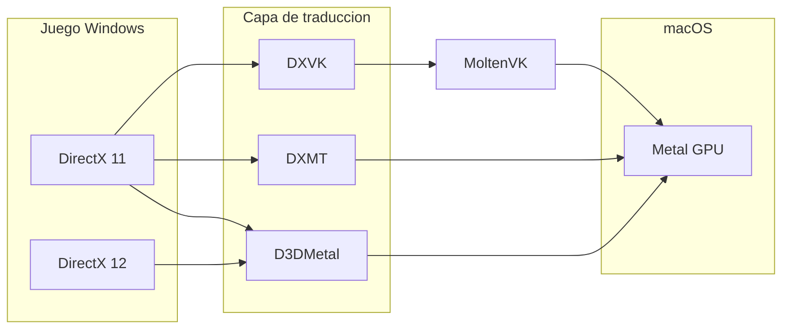

# D3DMetal y rendimiento en Kalimotxo

## ¿Qué es D3DMetal?

**D3DMetal** es la capa gráfica que Apple incluye en el [Game Porting Toolkit (GPTK)](https://developer.apple.com/games/game-porting-toolkit/). Traduce llamadas **DirectX 11 y DirectX 12** de Windows a **Metal**, la API gráfica nativa de macOS en Apple Silicon.



### Comparación rápida

| Capa | DirectX | Ruta a Metal | Licencia | Mejor para |
|------|---------|--------------|----------|------------|
| **D3DMetal** | DX11, **DX12** | Directo | Apple GPTK (redistribución limitada) | Diablo IV, juegos DX12, títulos AAA recientes |
| **DXMT** | DX10, DX11 | Directo | MIT (open source) | WoW, OW2 en DX11, muchos juegos Blizzard |
| **DXVK** | DX9–11 | Vulkan → MoltenVK | LGPL | Fallback si DXMT falla |
| **wined3d** | DX9–11 | OpenGL | LGPL | Compatibilidad, no rendimiento |

**Battle.net** usa sobre todo DirectX 11 en su cliente (CEF). Los juegos varían: **Diablo IV** necesita **D3DMetal** (DX12); **WoW** suele ir mejor con **DXMT** en modo DX11.

### Por qué no va dentro del `.dmg` público de GitHub

Apple restringe la **redistribución** de D3DMetal. Kalimotxo **no puede** commitear `D3DMetal.framework` en el repositorio abierto ni descargarlo desde nuestros servidores.

Lo que sí hace Kalimotxo:

1. **Instalación automática** en el setup y al lanzar juegos DX12: copia desde CrossOver, `Game Porting Toolkit.app`, DMGs en `~/Downloads`, o `brew install --cask gcenx/wine/game-porting-toolkit`.
2. **Embebido en builds privadas**: antes de `pnpm run dist:mac`, copia el contenido de `lib/external` del GPTK a `resources/bundled/d3dmetal/` (carpeta en `.gitignore`). Esa carpeta se empaqueta en `Kalimotxo.app` y se instala en el runtime la primera vez que hace falta.

```bash
# Ejemplo (mantenedor, build local con D3DMetal incluido)
mkdir -p resources/bundled/d3dmetal
cp -R "/Applications/Game Porting Toolkit.app/Contents/Resources/wine/lib/external/"* \
  resources/bundled/d3dmetal/
pnpm run dist:mac
```

---

## Cómo mejorar el rendimiento

### 1. Elegir el backend correcto por juego

Usa los perfiles en `data/compatibility.json` o el asistente «Instalar app»:

- **DX12 obligatorio** → D3DMetal (Diablo IV, D2R con renderer nuevo).
- **DX11** → probar **DXMT** primero; si hay glitches, **D3DMetal** o **DXVK**.
- Desactiva ray tracing y efectos «ultra» en juegos que no lo soportan bien bajo Wine.

### 2. Sincronización (ESync / MSync)

| Modo | Qué hace | Cuándo probarlo |
|------|----------|-----------------|
| **ESync** | Sincronización vía eventfd | Default; bueno en la mayoría de títulos Blizzard |
| **MSync** | Semáforos Mach | WoW y algunos MMO cuando ESync da stuttering |
| **Default** | Sin forzar | Si el juego crashea con ESync/MSync |

### 3. Variables de entorno útiles

```bash
WINEESYNC=1              # o WINEMSYNC=1
DXMT_ASYNC=1             # compilación async de shaders (DXMT)
WINE_SIMULATE_WRITECOPY=1  # Battle.net
MTL_HUD_ENABLED=1        # solo depuración: FPS GPU en pantalla
```

### 4. Hardware y sistema

- **Rosetta 2** instalado (Wine x86_64 en Apple Silicon).
- **GStreamer** instalado para audio/video en Wine.
- Cierra apps que usen mucha GPU (Chrome con muchas pestañas, etc.).
- **Una botella por juego grande** evita conflictos de DLL y registro.
- Resolución nativa o ligeramente menor; evita 4K + escalado HiDPI si va lento.

### 5. Roadmap de producto (próximas versiones)

Ver [`_bmad-output/planning-artifacts/roadmap/roadmap-v2.md`](../_bmad-output/planning-artifacts/roadmap/roadmap-v2.md): perfiles automáticos, benchmark por botella, asistente «¿qué backend uso?» y empaquetado `.app`.
